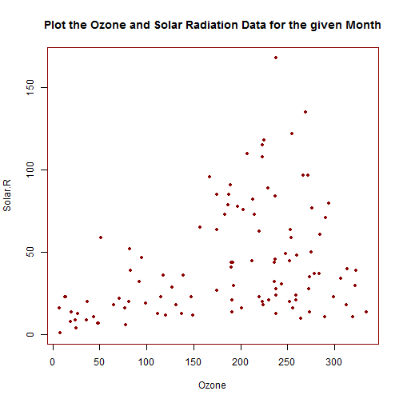

## Select the appropriate Data

1. The idea is to plot the airquality data for various months.
2. The in built dataset airquality is used here.
3. The user will select the Month for which he wants the plot to be displayed.
4. The variables used are the solar radiation levels, the Ozone levels and the Month

--- .

## The Plot to be displayed

 

--- .

## Output for the user

--- .

## Steps for the user

1. The user needs to select the appropriate Month from the dropdown box.
2. The plot displayed gets changed according to the Month that the user has selected.
